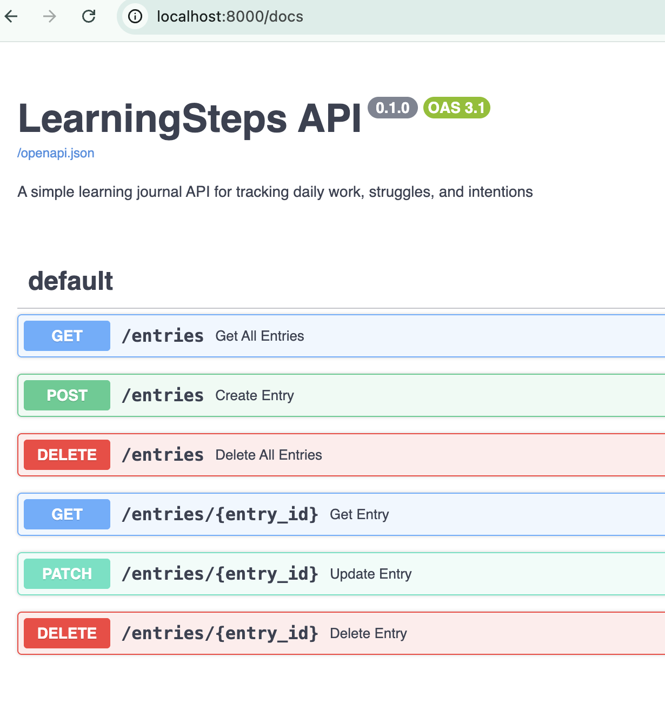
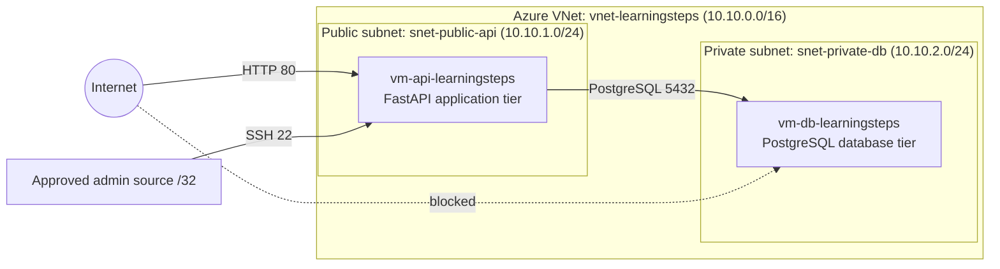

# LearningSteps Origins

Security-focused Azure 2-tier deployment case study for a FastAPI/PostgreSQL workload, prepared as a GitHub-ready DevSecOps portfolio repository.

> Naming note: `LearningSteps Origins` is the course project name for the Azure deployment exercise. The sanitized application bundle under `app/` is a hardened FastAPI/PostgreSQL workshop dashboard variant named `SWB | Second-Workshop-Brain`, which I used to validate the same public-app/private-db infrastructure pattern. This distinction is documented on purpose so the repository stays technically honest.

## Project Overview

This project documents the first cloud deployment stage for a FastAPI application running on Microsoft Azure with a security-first mindset:

- Public API tier hosted on an Azure VM
- Private PostgreSQL tier without public exposure
- Network segmentation through public and private subnets
- Least-privilege access enforced with NSGs and admin source restriction
- Evidence-driven validation for reachability, isolation, and persistence

The portfolio value is not only the running application, but the way the environment was planned, secured, verified, and documented.



## Scope and Objective

- Build and document a secure 2-tier Azure architecture for a FastAPI/PostgreSQL workload
- Prove that the API is reachable while the database stays private
- Capture architecture decisions, deployment steps, and validation evidence in a recruiter-friendly format
- Publish the result as a reproducible GitHub repository with CI, CodeQL, and release hygiene

## Architecture



## Technology Stack

- Python 3 / FastAPI
- PostgreSQL
- Microsoft Azure
- Network Security Groups
- systemd for service management
- GitHub Actions, CodeQL, and Dependabot
- PowerShell for local repo preflight checks

## Repository Structure

```text
.
|-- .github/
|-- app/
|   |-- .devcontainer/
|   |-- api/
|   |-- tests/
|   |-- .env.example
|   `-- start.sh
|-- docs/
|   |-- architecture/
|   `-- operations/
|-- evidence/
|-- reports/
|-- scripts/
|-- .env.example
|-- .gitattributes
|-- .gitignore
|-- README.md
`-- SECURITY.md
```

## Security Decisions

- The database tier has no public IP and is reachable only from the API subnet.
- Public ingress is limited to the API tier. Administrative SSH is restricted to a single approved `/32` source instead of open internet access.
- Validation was done against the effective NSG path, not only the intended subnet assignment. This exposed and fixed an ingress issue caused by a NIC-bound NSG.
- Secrets are intentionally excluded from version control. The public repository only includes sanitized examples.
- The application bundle itself adds host validation, CSRF protection, secure headers, rate limiting, and session controls to reduce the exposed surface of the app tier.

## Local Reproduction

1. Copy [`.env.example`](.env.example) to `app/.env` and replace the local placeholders.
2. Change into [`app/`](app/README.md).
3. Start the Dev Container or the included PostgreSQL compose setup from `app/.devcontainer/`.
4. Run `./start.sh`.
5. Open `http://localhost:8000` and optionally validate `/docs` locally with `SWB_ENABLE_DOCS=true`.

App-specific notes remain in [app/README.md](app/README.md).

## Azure Deployment Summary

- Region: `westeurope`
- Resource group: `rg-learningsteps-dev`
- VNet: `vnet-learningsteps` with `10.10.0.0/16`
- Public subnet: `snet-public-api` with `10.10.1.0/24`
- Private subnet: `snet-private-db` with `10.10.2.0/24`
- API VM: `vm-api-learningsteps`
- DB VM: `vm-db-learningsteps`

Detailed implementation notes are captured in:

- [Target architecture](docs/architecture/target-architecture.md)
- [Port matrix](docs/architecture/port-matrix.md)
- [Local validation](docs/operations/local-validation.md)
- [Deployment runbook](docs/operations/deployment-runbook.md)
- [GitHub publishing guide](docs/operations/github-publishing.md)
- [Evidence summary](evidence/verification-summary.md)
- [Final project report](reports/final-project-report.md)

## Validation and Evidence

The finished project phase validated the following outcomes:

- Local CRUD path and data persistence were confirmed
- The API tier was externally reachable in Azure
- The PostgreSQL tier remained private and reachable only from the API subnet
- SSH access was narrowed to a fixed admin source instead of broad internet exposure
- NSG drift on the effective path was found and corrected

The evidence package is intentionally public-safe: raw secrets, ephemeral admin IPs, and local-only working folders are not part of the release surface.

## GitHub Readiness

This repository is prepared for upload with:

- a rewritten portfolio README
- sanitized environment examples
- a root-level `SECURITY.md`
- CI and CodeQL workflows adapted to the current structure
- Dependabot configuration for both Python dependencies and GitHub Actions
- a local preflight script at [`scripts/repo-readiness-check.ps1`](scripts/repo-readiness-check.ps1)

## Lessons Learned

- Effective policy beats intended policy. Always validate the real enforcement path in Azure.
- Repo hygiene is part of security work. Nested `.git` folders, local `.env` files, and virtual environments have to be separated from the publishable surface early.
- Public portfolio documentation should be explicit about what is the course wrapper, what is the deployed workload, and what was intentionally redacted.

## Next Improvements

- Add HTTPS termination through Application Gateway or a reverse proxy
- Move runtime secrets into Azure Key Vault
- Replace direct SSH with Bastion or Just-in-Time access
- Add centralized logging, alerting, and backup/restore drills
