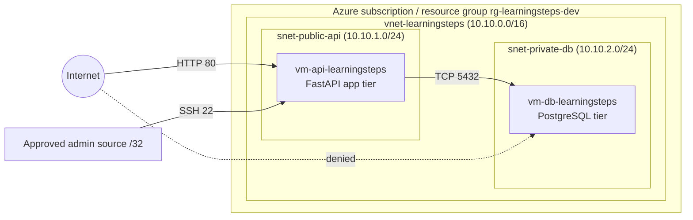

# Target Architecture

## Objective

Deploy a FastAPI/PostgreSQL workload into Azure with a clear trust boundary:

- the application tier is reachable from the internet
- the database tier stays private
- administrative access is more restricted than normal client access

## Architecture Diagram

## Resource Inventory

| Layer | Resource | Purpose | Exposure |
| --- | --- | --- | --- |
| Resource group | `rg-learningsteps-dev` | Logical container for the project workload | Not externally exposed |
| Network | `vnet-learningsteps` | Shared address space for app and DB tiers | Internal only |
| Public subnet | `snet-public-api` | Placement for the API VM | Indirectly exposed through the API VM public endpoint |
| Private subnet | `snet-private-db` | Placement for the PostgreSQL VM | Internal only |
| API tier | `vm-api-learningsteps` | Runs the FastAPI workload as a systemd service | HTTP reachable, SSH restricted |
| DB tier | `vm-db-learningsteps` | Stores PostgreSQL data | No public IP, internal reachability only |

## Trust Boundaries

### Boundary 1: Internet to API tier

- Allowed traffic: HTTP on port 80
- Administrative traffic: SSH on port 22 from an approved `/32` source only
- Rationale: expose only the workload entry point, not the data tier

### Boundary 2: API tier to DB tier

- Allowed traffic: PostgreSQL on port 5432 from the API subnet
- Rationale: application-to-database communication is necessary, but only from the public tier workload

### Boundary 3: Internet to DB tier

- Allowed traffic: none
- Rationale: the database is an internal service and should not be routable from the public internet

## Key Design Decisions

1. **Subnet separation first**  
   Public and private responsibilities were split before VM deployment so the network model stayed clear throughout the build.

2. **Least privilege at the network layer**  
   Only the paths required for the workload were opened: public HTTP to the API tier, restricted SSH for administration, and internal PostgreSQL access from the API subnet.

3. **Effective-path validation**  
   The project uncovered that the intended subnet NSG was not the only policy in effect. The final design therefore emphasizes testing the effective NSG path, not trusting the planned diagram alone.

4. **Public-safe documentation**  
   Ephemeral public IPs and private admin IP addresses used during testing are intentionally omitted from the publishable docs.
